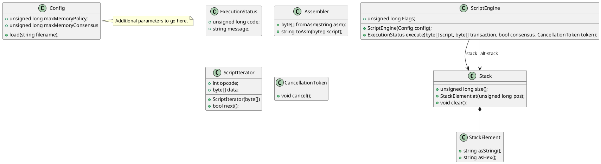

## Bscrypt object model

Object model is an approach to implement scripts functionalities in a object oriented fashion. The main function in script engine is the evaluation of the script. Other classes provide facilities to hold additional/auxiliare data to this function.

 - **config** class : hold all script's configuration prior to its evaluation.
 - **ExecutionStatus** class : hold the result of script's evaluation, i.e its return code and error message if any.
 - **Assembler** class : Implement method that convert a binary script to string script (the underlying data of a script is a binary array)
 - **ScriptEngine** class : hold the script configuration and script's evaluation flag switch. These determine how script should be evaluated. It has the execute method to evaluate a script
 - **Stack** class : hold the stack result of script evaluation.

