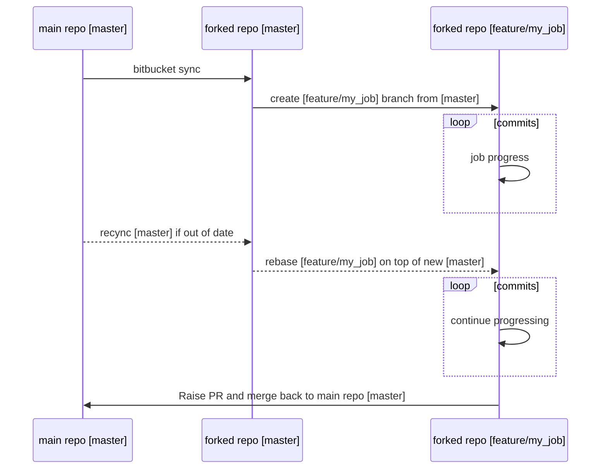

## Git working flow

We use the fork repository to enfore our git working flow.

- From the main repository, create a fork repository, then work only on that repository (never commit to master branch).
- If the main repository have some change, use bitbucket to sync the fork repository
- Always create a feature branch to work on
- If the fork is out of date, sync the master branch, then rebase the feature branch on the synced master
- Pull request is raised and merged when the job is reviewed and approved

