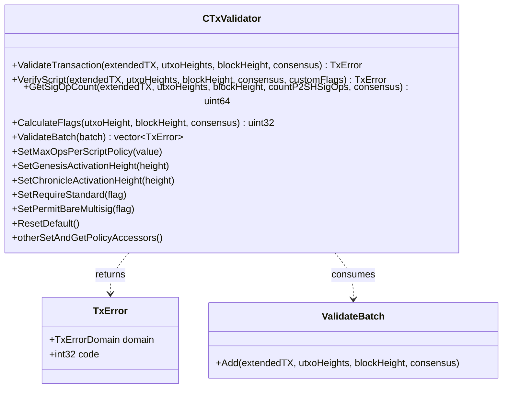

# Object Model

This page describes the real public API of the BDK core validation engine, `bsv::CTxValidator`
(`core/txvalidator.hpp`, `core/txvalidator.cpp`), and the Go type that wraps it.

`CTxValidator` is the single entry point for transaction and script validation. Its public **C++**
API exposes:

- **validation**: `ValidateTransaction`, `VerifyScript` (which takes an **optional `customFlags`**
  span — `core/txvalidator.hpp:202`), and `ValidateBatch`;
- **helpers**: `GetSigOpCount`, `CalculateFlags`;
- a large family of **policy accessors** (`Set*` / `Get*`), e.g. `SetMaxOpsPerScriptPolicy`,
  `SetMaxScriptNumLengthPolicy`, `SetMaxScriptSizePolicy`, `SetMaxPubKeysPerMultiSigPolicy`,
  `SetMaxStackMemoryUsage`, `SetGenesisActivationHeight`, `SetChronicleActivationHeight`,
  `SetMaxTxSizePolicy`, `SetMaxSigOpsPolicy`, `SetMaxSigOpsPostGenesisPolicy`,
  `SetMinMiningTxFee`, `SetDataCarrier(Size)`, `SetRequireStandard`, `SetPermitBareMultisig`,
  the consolidation-policy setters, `ResetDefault`, and their `Get*` counterparts.

> **Note:** there is **no** separate `VerifyScriptWithCustomFlags` method in C++ — the C++
> `VerifyScript` already accepts an optional `customFlags` argument. The Go binding
> (`module/gobdk/script/txvalidator.go`) splits that single C++ method into two convenience
> functions, `VerifyScript` and `VerifyScriptWithCustomFlags`.

Both `ValidateTransaction` and `VerifyScript` take a `consensus` boolean that selects the
policy (peer/mempool) vs. consensus (block) path — see
[Architecture overview](architecture.md#the-validation-engine-a-single-validatetransaction-entry-point)
and [VerifyScript](verify_script.md).

`TxError.domain` is one of `OK`, `SCRIPT`, `DOS`, or `EXCEPTION`; on the Go side it is translated to
`nil` (success) or a `ScriptError` / `DoSError`.

## Go binding

The Go type `script.TxValidator` (`module/gobdk/script/txvalidator.go`) is a thin cgo wrapper that
holds an opaque pointer to a C++ `CTxValidator`, mirrors the methods above (exposing both
`VerifyScript` and `VerifyScriptWithCustomFlags` over the single C++ `VerifyScript`), and translates
the returned `TxError` into a Go `error` (`nil` on success, otherwise a `ScriptError` or
`DoSError`). A finalizer calls the C++ destructor when the Go object is garbage-collected.
