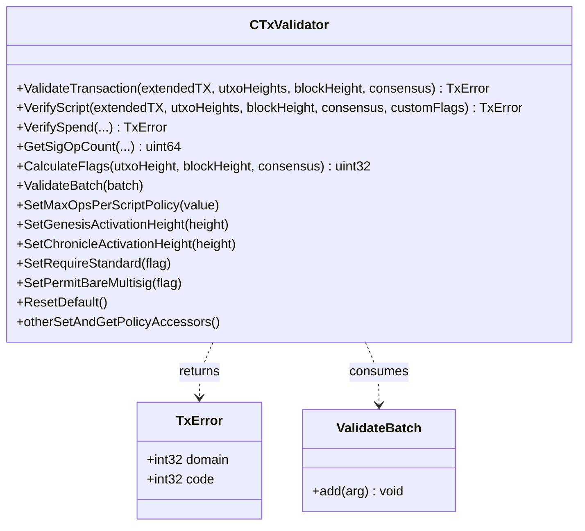

# Object Model

This page describes the public API of the BDK core validation engine, `bsv::CTxValidator`
(`core/txvalidator.hpp`, `core/txvalidator.cpp`), and the Go type that wraps it.

`CTxValidator` is the single entry point for transaction and script validation. Its public **C++**
API includes:

- **validation**: `ValidateTransaction`, `VerifyScript` (which takes an **optional `customFlags`**
  span — `core/txvalidator.hpp`, `VerifyScript`), and `ValidateBatch`;
- **single-input verification**: `VerifySpend`, with ordinary transaction bytes, input index, previous locking script and amount, heights, mode, and optional flags;
- **helpers**: `GetSigOpCount`, `CalculateFlags`;
- **individual checks**: `CheckStandardness`, `CheckPrevOutputs`, `CheckOutputs`, `CheckConsensusSigops`, `CheckSigOpsPolicy`, and `IsFreeConsolidation`;
- a large family of **policy accessors** (`Set*` / `Get*`), e.g. `SetMaxOpsPerScriptPolicy`,
  `SetMaxScriptNumLengthPolicy`, `SetMaxScriptSizePolicy`, `SetMaxPubKeysPerMultiSigPolicy`,
  `SetMaxStackMemoryUsage`, `SetGenesisActivationHeight`, `SetChronicleActivationHeight`,
  `SetMaxTxSizePolicy`, `SetMaxSigOpsPolicy`, `SetMaxSigOpsPostGenesisPolicy`,
  `SetMinMiningTxFee`, `SetDataCarrier(Size)`, `SetRequireStandard`, `SetPermitBareMultisig`,
  the consolidation-policy setters, `ResetDefault`, and their `Get*` counterparts.

> **Note:** there is **no** separate `VerifyScriptWithCustomFlags` method in C++ — the C++
> `VerifyScript` already accepts an optional `customFlags` argument. The Go binding
> (`module/gobdk/script/txvalidator.go`) splits that single C++ method into two convenience
> functions, `VerifyScript` and `VerifyScriptWithCustomFlags`.

Both `ValidateTransaction` and `VerifyScript` take a `consensus` boolean that selects the
policy (peer/mempool) vs. consensus (block) path — see
[Architecture overview](architecture.md#the-validation-engine-a-single-validatetransaction-entry-point)
and [VerifyScript](verify_script.md).

The diagram abbreviates the `VerifySpend` argument list: `transaction`, `inputIndex`,
`lockingScript`, `sourceSatoshis`, `utxoHeight`, `blockHeight`, `consensus`, and
`customFlags`. `GetSigOpCount` takes `extendedTX`, `utxoHeights`, `blockHeight`,
`countP2SHSigOps`, and `consensus`. `ValidateBatch` returns `std::vector<TxError>`, one result per batch entry.

`TxError` contains two 32-bit integers: `domain` and `code`. Domain values are `OK` (0), `SCRIPT` (1), `DOS` (2), and `EXCEPTION` (3). Go maps success to `nil`, script errors to `ScriptError`, DoS errors to `DoSError`, and exception results to `ScriptError` with `SCRIPT_ERR_CGO_EXCEPTION`. An unknown domain produces a generic Go error. Inspect both fields when debugging.

## Go binding

The Go type `script.TxValidator` (`module/gobdk/script/txvalidator.go`) is a thin cgo wrapper that
holds an opaque pointer to a C++ `CTxValidator` and exposes transaction validation, script
verification, batching, flag/sigop helpers and policy accessors. It provides both `VerifyScript`
and `VerifyScriptWithCustomFlags` over the single C++ `VerifyScript` method, but does not expose
`VerifySpend` or the individual checks listed above. It translates
the returned `TxError` into a Go `error` (`nil` on success, otherwise the error mapping described above). A finalizer calls the C++ destructor when the Go object is garbage-collected.

`ValidateTransaction` rejects coinbase transactions. The caller must supply accurate previous-output data and heights; this API does not look up the node's UTXO set. See [Debugging transaction validation](debug_transaction.md).
