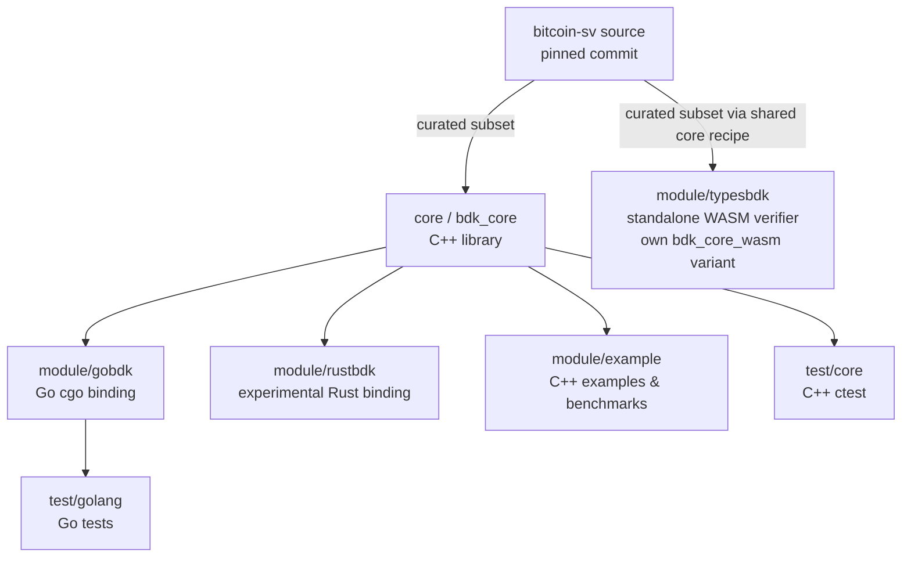

# Architecture overview

The Bitcoin Development Kit (BDK) packages a focused slice of `bitcoin-sv` (BSV) — the script and
transaction-validation engine — into a stand-alone C++ library and language bindings, so that
applications can validate Bitcoin SV transactions with behaviour matching the node, without
building the whole node.

## The big picture



- **`core/`** builds `bdk_core`, the C++ library. It is assembled from BDK's own sources
  (`core/*.cpp`) plus a **curated subset of the bitcoin-sv sources** (see below).
- **`module/`** holds extension applications and language bindings that build on top of core and
  are independent of each other: the Go (cgo) binding, the experimental Rust binding, and the C++
  examples/benchmarks. They link `bdk_core`; note
  that the C++ examples, the GoBDK cgo library, and the Rust `bdkffi` library additionally
  **compile in** the 15 "application" BSV sources directly (see the source-subset table below), so
  they are not purely linking core. The WASM/TypeScript verifier also lives under `module/`, but
  it is a **standalone build** that assembles its own core variant instead of linking the shared
  `bdk_core` (see [The typesbdk WASM verifier](#the-typesbdk-wasm-verifier)).
- **`test/`** holds the C++ (`test/core`, via `ctest`) and Go (`test/golang`) test suites.

The CMake build (root `CMakeLists.txt`, minimum version 3.16) assembles `bdk_core`, builds the
language-binding modules, runs the tests via `ctest`, and builds this documentation via the
`core_doc` target. See [Development Build](build.md).

## The curated bitcoin-sv source subset

BDK does **not** compile all of bitcoin-sv. It compiles an explicitly-listed subset of `src/…`
paths, declared in `cmake/modules/FindBSVSourceHelper.cmake` and split into **two sets** whose
compilation targets differ:

| Set | Function | `.cpp` files | Compiles into |
|-----|----------|-------------:|---------------|
| **Minimal** | `bdkSetMinimumListBSVSource` (`FindBSVSourceHelper.cmake:85-201`) | **36** | the `bdk_core` library |
| **Application** | `bdkSetApplicationListBSVSource` (`FindBSVSourceHelper.cmake:204-296`) | **15** | examples, the GoBDK cgo lib, the Rust `bdkffi` lib, and the core tests — **not** `bdk_core` |

That is **36 + 15 = 51** BSV `.cpp` files in total (plus their headers).

- The **minimal** set is a **superset of bitcoin-sv's `libconsensus`**. It is what actually links
  into the library: `core/CMakeLists.txt:62` sets
  `BDK_CORE_SRC_FILES = <core/*.cpp> + BSV_MINIMAL_SRC_FILES`, and `core/CMakeLists.txt:71` builds
  `add_library(bdk_core … ${BDK_CORE_SRC_FILES})`. So `bdk_core` = the 36 minimal BSV sources +
  BDK's own `core/*.cpp` + the generated `BDKVersion.cpp`.
- The **application** set (`BSV_APPLICATION_SRC_FILES`) is **not** linked into `bdk_core`. It is
  compiled directly into the consumer targets instead: the C++ examples
  (`module/example/CMakeLists.txt`), the **GoBDK** cgo static library
  (`module/gobdk/bdkcgo/CMakeLists.txt`), the Rust `bdkffi` static library
  (`module/rustbdk/capi/CMakeLists.txt`), and the `test/core` executables
  (`test/core/CMakeLists.txt`).

## The validation engine: a single `ValidateTransaction` entry point

The heart of `bdk_core` is `bsv::CTxValidator` (`core/txvalidator.hpp` / `core/txvalidator.cpp`).
Its public C++ API exposes `ValidateTransaction`, `VerifyScript` (which takes an optional
`customFlags` span — `core/txvalidator.hpp:202`), `GetSigOpCount`, `CalculateFlags`, `ValidateBatch`,
and a large family of `Set*`/`Get*` policy accessors. (The Go binding splits the single C++
`VerifyScript` into two convenience methods, `VerifyScript` and `VerifyScriptWithCustomFlags` —
see [the cgo boundary](#the-cgo-boundary-gobdk).)

In legacy bitcoin-sv, transaction validation lives in **two separate functions** depending on where
the transaction came from:

- a transaction from a **peer** → mempool acceptance → **policy** rules (policy + consensus checks);
- a transaction from a **block** → block connection → **consensus** rules only.

BDK collapses both into a **single** `ValidateTransaction` entry point that **branches internally on
a `consensus` boolean** (`core/txvalidator.cpp`):

```cpp
// policy era is blockHeight+1 (next block); consensus era is blockHeight
const int32_t checkHeight = consensus ? blockHeight : blockHeight + 1;
... common checks (transaction, prev-outputs, outputs) ...
if (!consensus) {
    // policy path: standardness + policy sigops
} else {
    // consensus path: consensus sigops only
}
... input-value checks ...
if (!consensus) {
    // fee check runs only in policy mode
}
return implVerifyScript(..., consensus);
```

So:

- `consensus = false` → **peer / mempool** context: policy *and* consensus checks (standardness,
  policy sigops, fee).
- `consensus = true` → **block** context: consensus checks only.

This is the same consensus-vs-policy distinction documented in detail (with the flag sets and the
"up to three `CheckInputs` calls" peer path) in [VerifyScript](verify_script.md). Consumers that
need block-vs-peer behaviour simply pass the appropriate `consensus` value.

## The cgo boundary (GoBDK)

The Go binding (`module/gobdk`, import path `github.com/bitcoin-sv/bdk/module/gobdk`) wraps the C++
`CTxValidator` through cgo. The Go `script.TxValidator` (`module/gobdk/script/txvalidator.go`) holds
an opaque pointer to a C++ `TxValidator` created via `TxValidator_Create`, sets a finalizer to call
`TxValidator_Destroy` on GC, and forwards each call (`ValidateTransaction`, `VerifyScript`,
`GetSigOpCount`, the policy setters, …) across the cgo boundary. The `consensus` boolean described
above is passed straight through:

```go
func (se *TxValidator) ValidateTransaction(extendedTX []byte, utxoHeights []int32,
        blockHeight int32, consensus bool) error
// consensus=false → peer context (policy + consensus checks)
// consensus=true  → block context (consensus checks only)
```

### GoBDK prebuilt static libraries

To make `go get` "just work" without a local C++ build, `module/gobdk/bdkcgo/` ships **four**
committed static archives — one per supported platform/arch:

- `libGoBDK_linux_x86_64.a`
- `libGoBDK_linux_aarch64.a`
- `libGoBDK_darwin_arm64.a`
- `libGoBDK_darwin_x86_64.a`

There is **no Windows archive** (Windows is experimental/unsupported — see
[build.md](build.md#windows-experimental-unsupported)).

CI can rebuild and **auto-commit** these archives via the `commit-static-gobdk` job, but only under
a specific gate — **not** on every build. All of the following must hold
(`build_bdk.yaml:128-140,169-211`, condition at `:174`):

1. the trigger is a **manual `workflow_dispatch`**, and
2. the `commit-built-binaries` input is **`true`**, and
3. the matrix build **succeeds** (`success()`), and
4. the archives have actually **changed** (`gobdk_change.outputs.modified == 'true'`, which is only
   evaluated on `workflow_dispatch`), and
5. the head commit does **not** contain the `[GoBDKUpdate]` marker — the marker the bot itself uses
   when it commits, which prevents an infinite rebuild loop.

When all conditions are met, the bot commits the refreshed archives with a `[GoBDKUpdate]` message.

## The typesbdk WASM verifier

`module/typesbdk` provides the JavaScript/WebAssembly binding for `CTxValidator::VerifyScript`.

The WASM verifier requires aggressive size optimization to be deployable in browsers and SDKs:
no OpenSSL (which forces substituting the OpenSSL-backed `big_int.cpp`/`random.cpp` with a
Boost-based bigint backend and a wasm-safe cleanse), runtime-reconstructed secp256k1
verification tables, and a minimal runtime. Threading those deviations through the shared build
would deform the regular build architecture — core is the upstream-tracking trunk that
gobdk/rustbdk link, and its build must stay canonical. The WASM build is therefore a fully
**standalone module build**: it reuses the shared core *recipe*
(`core/bdk-core-recipe.cmake`, the same curated bitcoin-sv source lists and
`bdk_add_core_library()` factory that produce the native `bdk_core`) to assemble its own
`bdk_core_wasm` variant inside the module directory, and the canonical `bdk_core` is never
modified by any module.

It configures with `-DBDK_BUILD_CORE=OFF -DBDK_BUILD_TYPES=ON` under the Emscripten toolchain
rather than as part of the default native build. The pinned `wasm/build.sh` performs a clean
Emscripten build, runs standalone libsecp256k1 tests and real positive/negative transaction
vectors, and installs the validated `bdk-core.mjs` and `bdk-core.wasm` artifacts. See
`module/typesbdk/examples/README.md` for the reproducible build, ABI, and native/WASM benchmark
controls, and [Development Build](build.md) for the flags and the prebuilt Boost package.
