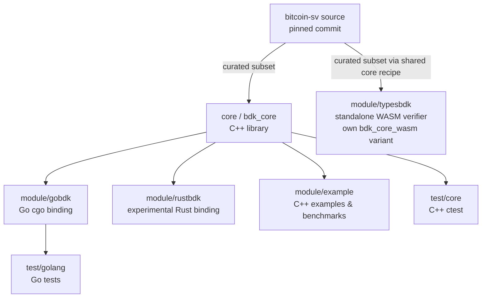

# Architecture overview

The Bitcoin Development Kit (BDK) packages a focused slice of `bitcoin-sv` (BSV) — the script and
transaction-validation engine — into a stand-alone C++ library and language bindings, so that
applications can validate Bitcoin SV transactions with behaviour matching the node, without
building the whole node.

## The big picture

A module must never modify source files in BDK's `core/`. If the core does not
provide something a module needs, the module must handle it inside its own module
directory. Modules may carry extra files for their special features there.
Module-specific handling must never be implemented at core level: do not add
language-specific branches such as “if rust then ...” to core sources, or
module-specific special cases to the core build. Language adapters belong in
their modules and consume the common validation implementation.

BDK also keeps the checked-out `bitcoin-sv` C++ sources unchanged. Shared additions,
such as the extended-transaction representation, belong in BDK's `core/` and
must be reviewed for compatibility with upstream behavior. This shared-core
extension work must not introduce module-specific handling. Selecting which
modules to build at the repository root does not authorize changing core sources
or core behavior for a particular module.

WASM is permitted a dedicated build mechanism for aggressive browser optimization.
It uses the common recipe to create its own `bdk_core_wasm` target inside its
module build. Its extra bigint, memory-cleansing and secp256k1 runtime-table
implementations belong to `module/typesbdk/wasm/`; they do not modify core source
files, the checked-out upstream files or the canonical native `bdk_core` target.
Changes must preserve the behavior of the corresponding native operations and
pass the relevant parity tests.

The WASM parity suite is another example of the correct module-local pattern.
Its generator and adaptations live under `module/typesbdk/wasm/`, and it generates
a patched copy of upstream secp256k1 `tests.c` under that module's binary directory,
`<build>/module/typesbdk/wasm/wasm_tests_patched/tests.c`. The module solves its own
need with its own files; it does not modify core sources or the upstream checkout.
This follows the strong module/core boundary rule.

<style>.mermaid { overflow-x: auto; }</style>



- **`core/`** builds `bdk_core`, the C++ library. It is assembled from BDK's own sources
  (`core/*.cpp`) plus a **curated subset of the bitcoin-sv sources** (see below).
- **`module/`** holds extension applications and language bindings that build on top of core and
  are independent of each other: the Go (cgo) binding, the experimental Rust binding, and the C++
  examples/benchmarks. They link `bdk_core`; note
  that the C++ examples, the GoBDK cgo library, and the Rust `bdkffi` library additionally
  **compile in** the 15 "application" BSV sources directly (see the source-subset table below), so
  they are not purely linking core. The WASM/TypeScript verifier also lives under `module/`, but
  it is a **standalone build** that assembles its own core variant instead of linking the shared
  `bdk_core` (see [The typesbdk WASM verifier](#the-typesbdk-wasm-verifier)).
- **`test/`** holds C++ core tests, Go tests, Rust linkage tests, and WASM tests in `test/core`, `test/golang`, `test/rust`, and `test/types`, respectively. CTest registers the applicable suites for each build.

The CMake build (root `CMakeLists.txt`, minimum version 3.16) assembles `bdk_core`, builds the
language-binding modules, registers tests for execution via `ctest`, and builds this documentation via the
`core_doc` target. See [Development Build](build.md).

## The curated bitcoin-sv source subset

BDK does **not** compile all of bitcoin-sv. It compiles an explicitly-listed subset of `src/…`
paths, declared in `cmake/modules/FindBSVSourceHelper.cmake` and split into **two sets** whose
compilation targets differ:

| Set | CMake function | Listed `.cpp` paths | Consumers |
|-----|----------------|--------------------:|-----------|
| Minimal | `bdkSetMinimumListBSVSource` | 37 | Canonical `bdk_core`; the WASM variant applies explicit exclusions |
| Application | `bdkSetApplicationListBSVSource` | 15 | C++ examples, GoBDK cgo library, Rust `bdkffi` library, and core tests |

The lists contain 52 entries but 51 distinct paths: `src/support/cleanse.cpp`
appears in both. These counts describe the lists, not every translation unit in
the complete build, which also includes BDK sources and bundled libraries.

`core/CMakeLists.txt` calls `bdk_add_core_library(bdk_core ...)`. That factory,
in `core/bdk-core-recipe.cmake`, combines the minimal list with BDK's `core/*.cpp`
files and generated `BDKVersion.cpp`. The application list is supplied directly
by the consumer CMake files; it is not appended to the canonical core's source list.

## The validation engine: a single `ValidateTransaction` entry point

The heart of `bdk_core` is `bsv::CTxValidator` (`core/txvalidator.hpp` / `core/txvalidator.cpp`).
Its public C++ API includes `ValidateTransaction`, `VerifyScript` with an optional `customFlags` span, `VerifySpend` for a single input with an explicitly supplied previous output, `GetSigOpCount`, `CalculateFlags`, `ValidateBatch`, individual transaction-check helpers, and policy accessors. See [Object Model](ObjectModel.md). The Go binding exposes both `VerifyScript` and `VerifyScriptWithCustomFlags` over the C++ `VerifyScript` method.

In legacy bitcoin-sv, transaction validation lives in **two separate functions** depending on where
the transaction came from:

- a transaction from a **peer** → mempool acceptance → **policy** rules (policy + consensus checks);
- a transaction from a **block** → block connection → **consensus** rules only.

BDK collapses both into a **single** `ValidateTransaction` entry point that **branches internally on
a `consensus` boolean** (`core/txvalidator.cpp`):

```cpp
// policy era is blockHeight+1 (next block); consensus era is blockHeight
const int32_t checkHeight = consensus ? blockHeight : blockHeight + 1;
... common checks (transaction, prev-outputs, outputs) ...
if (!consensus) {
    // policy path: standardness + policy sigops
} else {
    // consensus path: consensus sigops only
}
... input-value checks ...
if (!consensus) {
    // fee check runs only in policy mode
}
return implVerifyScript(..., consensus);
```

So:

- `consensus = false` → **peer / mempool** context: policy *and* consensus checks (standardness,
  policy sigops, fee).
- `consensus = true` → **block** context: consensus checks only.

This boolean selects BDK's transaction-checking context. The upstream node also performs chain-state, mempool and block-management work outside this API. See [VerifyScript](verify_script.md) for upstream flag handling and [Debugging transaction validation](debug_transaction.md) for a reproducible BDK replay.

## Module independence rules

`module/rustbdk` is an independent BDK module. The binding follows these rules:

1. It depends on `bdk_core`, its public headers, and the shared third-party and
   bitcoin-sv link-closure inputs that `bdk_core` needs.
2. It must not include, link, copy, symlink, read at build time, or edit files
   from sibling modules such as `module/gobdk`, `module/typesbdk`, or
   `module/example`.
3. Its C ABI is defined inside `module/rustbdk` and uses the distinct
   `bdkffi_` symbol prefix.
4. Its static archive is `libbdkffi_<os_arch>.a`; it must never fall back to a
   GoBDK archive.
5. Consensus and policy logic remain in `bdk_core`; Rust wraps that logic rather
   than reimplementing it.
6. The crates stay layered: `bdk-sys` owns raw FFI, and `rust-bdk` exposes the
   safe public API.
7. Validation parity comes from calling the same `bdk_core`
   `ValidateTransaction(..., consensus)` implementation. `consensus=true` means
   block/consensus rules, while `consensus=false` means peer/mempool policy
   rules.

These rules keep language adapters independent while sharing validation behavior. Rust's C ABI and archive are owned by its module; the canonical core must not acquire Rust-specific validation branches. See [Rust usage](index.md#rust-experimental) and [Rust build instructions](build.md#building-the-rust-binding-experimental).

## The cgo boundary (GoBDK)

The Go binding (`module/gobdk`, import path `github.com/bitcoin-sv/bdk/module/gobdk`) wraps the C++
`CTxValidator` through cgo. The Go `script.TxValidator` (`module/gobdk/script/txvalidator.go`) holds
an opaque pointer to a C++ `CTxValidator` created via `TxValidator_Create`, sets a finalizer to call
`TxValidator_Destroy` on GC, and forwards each call (`ValidateTransaction`, `VerifyScript`,
`GetSigOpCount`, the policy setters, …) across the cgo boundary. The `consensus` boolean described
above is passed straight through:

```go
func (se *TxValidator) ValidateTransaction(extendedTX []byte, utxoHeights []int32,
        blockHeight int32, consensus bool) error
// consensus=false → peer context (policy + consensus checks)
// consensus=true  → block context (consensus checks only)
```

### GoBDK prebuilt static libraries

To make `go get` "just work" without a local C++ build, `module/gobdk/bdkcgo/` ships **four**
committed static archives — one per supported platform/arch:

- `libGoBDK_linux_x86_64.a`
- `libGoBDK_linux_aarch64.a`
- `libGoBDK_darwin_arm64.a`
- `libGoBDK_darwin_x86_64.a`

The native CI matrix refreshes Linux x86_64, Linux aarch64 and macOS arm64; the committed macOS x86_64 archive is not part of that matrix.

There is **no Windows archive** (Windows is experimental/unsupported — see
[build.md](build.md#windows-experimental-unsupported)).

CI can rebuild and **auto-commit** these archives, but only under a specific gate — **not** on
every build. The gate lives in the single `commit-built-artifacts` job of `build_bdk.yaml`, which
handles both committed-binary families (the gobdk archives and the typesbdk WASM artifacts) so
that the two artifact families share one push job within a workflow run.

`build_bdk.yaml` is the only manually dispatchable workflow in this pipeline. Its dispatch form
carries **two independent checkboxes** — `commit-gobdk-archives` and `commit-wasm-artifacts` — and
all four combinations are meaningful: gobdk only, wasm only, both, neither (build and test
everything, commit nothing). The wasm leg (`build_wasm.yaml`, invoked through `workflow_call`) runs
on **every** dispatch regardless of the checkboxes, and `commit-built-artifacts` `needs:` both
legs with default `success()` semantics, so **any red leg blocks all commits** — including for the
family whose box was ticked.

Inside the job:

1. the trigger must be a **manual `workflow_dispatch`** and at least one box must be ticked;
2. **loop-breaker markers** are read from the head commit *with git*, not from
   `github.event.head_commit.message` (that context is populated on `push` events only, so on the
   dispatch trigger an expression guard would evaluate `contains(null, …)` → false and never
   suppress anything). `[GoBDKUpdate]` suppresses a further gobdk commit and `[WasmBDKUpdate]` a
   further wasm commit — each family breaks only its own rebuild loop;
3. **"did it change" is decided per family by a staged `git diff --cached --quiet`**, never by a
   build leg's job output. `build-bdk` is a three-leg matrix and all legs write one job-level
   `modified` output, so relying on that output could hide a changed archive when
   the platforms disagree;
4. because the job now runs even when nothing changed, each Unix matrix leg uploads a small
   `gobdk-status-<os_arch>` marker on **every** dispatch stating whether its archive changed. That
   is what separates "no archive changed" from "the download failed": the job derives the expected
   archive set from the three markers (the count is pinned to the matrix length), skips the archive
   download when the set is empty, and **fails hard** when an expected archive does not arrive. No
   step in the job uses `continue-on-error`, precisely so a real artifact-service failure goes red
   instead of quietly committing nothing;
5. the commit steps run **sequentially**, creating a separate commit for each selected,
   unsuppressed family whose staged files changed. Each commit carries its own marker and
   can be reverted independently. There is exactly **one push step, at the end**.

The bot commits with `[bot] [GoBDKUpdate] …` and `[bot] [WasmBDKUpdate] …` subjects.

## The typesbdk WASM verifier

`module/typesbdk` provides the JavaScript/WebAssembly binding for `CTxValidator::VerifyScript`.

The WASM verifier requires aggressive size optimization to be deployable in browsers and SDKs:
no OpenSSL (the build excludes `big_int.cpp`, `random.cpp`, and `support/cleanse.cpp`, adds a Boost-based bigint backend and a WASM memory-cleanse implementation), runtime-reconstructed secp256k1
verification tables, and a minimal runtime. Threading those deviations through the shared build
would deform the regular build architecture — core is the upstream-tracking trunk that
gobdk/rustbdk link, and its build must stay canonical. The WASM build is therefore a fully
**standalone module build**: it reuses the shared core *recipe*
(`core/bdk-core-recipe.cmake`, the same curated bitcoin-sv source lists and
`bdk_add_core_library()` factory that produce the native `bdk_core`) to assemble its own
`bdk_core_wasm` variant inside the module directory, and the canonical `bdk_core` is never
modified by any module.

It configures with `-DBDK_BUILD_CORE=OFF -DBDK_BUILD_WASM=ON` under the Emscripten toolchain
rather than as part of the default native build, and that same root block adds `test/types`
alongside the module directory.

Build inputs, tests and publishing are three separate places:

- `module/typesbdk/wasm/` holds the build inputs and the eight committed artifacts, and its
  `CMakeLists.txt` defines **targets only**;
- `test/types/` owns **every** CTest registration for the module, mirroring what `test/golang` and
  `test/rust` do for the other two bindings. It defines no build target, so the wasm `ALL` target
  and the shipped artifact bytes cannot be perturbed by test code. It is added from the root
  `if(BDK_BUILD_WASM)` block, never from `test/CMakeLists.txt` (native-only, and it requires
  `Boost::unit_test_framework`);
- `wasm/build.sh` is a facility script that automates the clean configure and build only. It runs
  no test — `ctest` in the build directory does that — and publishes nothing. It makes no version
  decisions of its own: the bitcoin-sv commit, the Boost 1.85.0 package and the Emscripten 4.0.23
  SDK are pinned by the environment (CI, or the developer's local install).

CI publishes the WASM artifacts only when publication is requested and the selected
bitcoin-sv commit equals the workflow's default pin.

The eight committed artifacts are a **refreshed-on-demand convenience**, not a build-reproducibility
contract: `cmake --build build-wasm --target bdk_wasm_install_insource` is the only thing that
writes them, and only the CI commit path (a `build_bdk.yaml` dispatch with `commit-wasm-artifacts`
ticked) invokes it. This matches how `module/gobdk/bdkcgo/libGoBDK_*.a` is handled. Pull requests
no longer byte-compare the tracked artifacts against a fresh pinned build, and nothing reports the
difference: drift between a source change and the next refresh is expected and allowed, so a pull
request that touches wasm sources does not have to carry regenerated binaries.

See [module/typesbdk/wasm/README.md](https://github.com/bitcoin-sv/bdk/blob/master/module/typesbdk/wasm/README.md) for the directory layout, [test/types/README.md](https://github.com/bitcoin-sv/bdk/blob/master/test/types/README.md) for the
twelve CTest entries and the toolchain-free node runner,
[module/typesbdk/examples/README.md](https://github.com/bitcoin-sv/bdk/blob/master/module/typesbdk/examples/README.md) for the ABI and the native/WASM benchmark controls, and
[Development Build](build.md) for the flags and the prebuilt Boost package.
