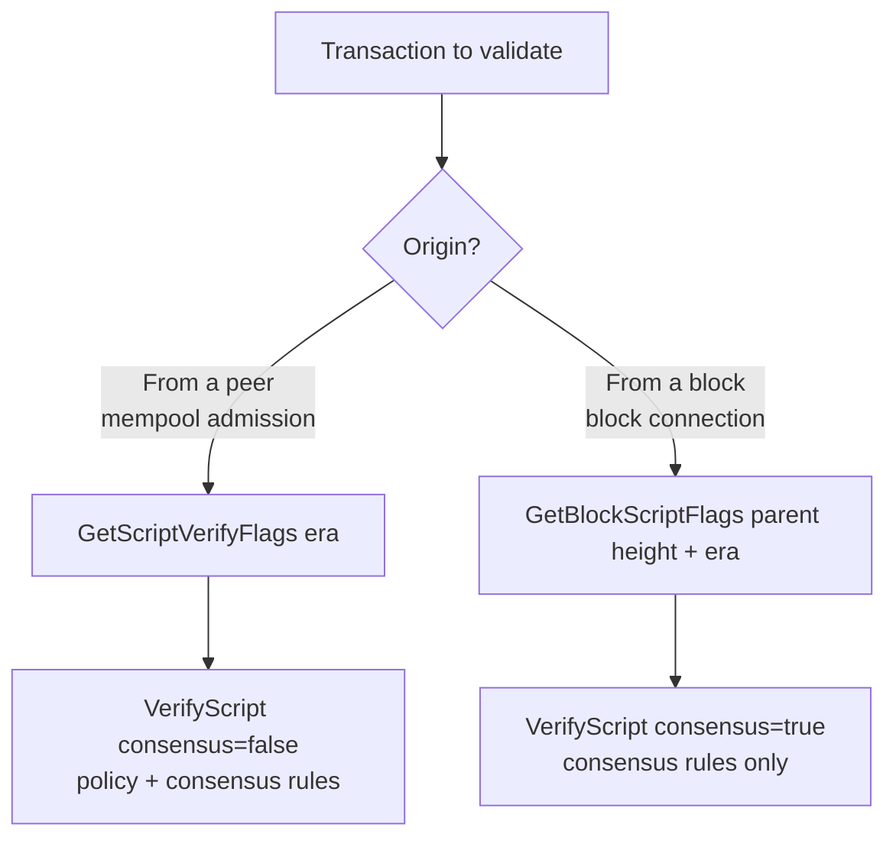

# Verify Script



Bitcoin SV calls `VerifyScript` from several contexts with different flags and policy settings. This page explains the pinned upstream implementation for BDK developers. For a practical replay, see [Debugging transaction validation](debug_transaction.md).

Generally speaking, `VerifyScript` is called in two main contexts:

- A transaction arrives from a peer for mempool admission.
- A transaction is checked while connecting a block.

Block-context script checks use `consensus=true`. Peer/mempool checks use `consensus=false`, which also applies policy limits. This describes the validation context; BDK does not perform the node's peer-management or chain-state operations.

The two contexts use different base-flag calculations:

- [GetScriptVerifyFlags](https://github.com/bitcoin-sv/bitcoin-sv/blob/879fc8b42168dd0e608dafd51b39c6dabad37d4d/src/verify_script_flags.h#L9) computes base flags for peer/mempool validation
- [GetBlockScriptFlags](https://github.com/bitcoin-sv/bitcoin-sv/blob/879fc8b42168dd0e608dafd51b39c6dabad37d4d/src/verify_script_flags.h#L19) computes base flags for block validation

## Flag calculation

A flag set is a bitwise combination of individual flags. `SCRIPT_VERIFY_NONE` is zero; `SCRIPT_FLAG_LAST` is a boundary marker rather than a verification rule.

```
    SCRIPT_VERIFY_NONE
    SCRIPT_VERIFY_P2SH
    SCRIPT_VERIFY_STRICTENC
    SCRIPT_VERIFY_DERSIG
    SCRIPT_VERIFY_LOW_S
    SCRIPT_VERIFY_NULLDUMMY
    SCRIPT_VERIFY_SIGPUSHONLY
    SCRIPT_VERIFY_MINIMALDATA
    SCRIPT_VERIFY_DISCOURAGE_UPGRADABLE_NOPS
    SCRIPT_VERIFY_CLEANSTACK
    SCRIPT_VERIFY_CHECKLOCKTIMEVERIFY
    SCRIPT_VERIFY_CHECKSEQUENCEVERIFY
    SCRIPT_VERIFY_MINIMALIF
    SCRIPT_VERIFY_NULLFAIL
    SCRIPT_VERIFY_COMPRESSED_PUBKEYTYPE
    SCRIPT_ENABLE_SIGHASH_FORKID
    SCRIPT_GENESIS
    SCRIPT_UTXO_AFTER_GENESIS      // Per-input: UTXO was created after Genesis activation
    SCRIPT_CHRONICLE
    SCRIPT_UTXO_AFTER_CHRONICLE    // Per-input: UTXO was created after Chronicle activation
    SCRIPT_FLAG_LAST
```

The following lists expand the base flag calculations for the two contexts.

`GetScriptVerifyFlags` can have these flags, depending on the era (derived from chain tip + 1)

```
    SCRIPT_VERIFY_P2SH
    SCRIPT_VERIFY_STRICTENC
    SCRIPT_VERIFY_DERSIG
    SCRIPT_VERIFY_LOW_S
    SCRIPT_VERIFY_NULLDUMMY
    SCRIPT_VERIFY_MINIMALDATA
    SCRIPT_VERIFY_DISCOURAGE_UPGRADABLE_NOPS
    SCRIPT_VERIFY_CLEANSTACK
    SCRIPT_VERIFY_CHECKLOCKTIMEVERIFY
    SCRIPT_VERIFY_CHECKSEQUENCEVERIFY
    SCRIPT_VERIFY_NULLFAIL
    SCRIPT_ENABLE_SIGHASH_FORKID
    SCRIPT_GENESIS   // If genesis is activated (regardless of Chronicle)
    SCRIPT_CHRONICLE // If Chronicle is activated (both SCRIPT_GENESIS and SCRIPT_CHRONICLE are set when both eras are active)
    // When require_standard = false:
    //   If promiscuous mempool flags are set, the entire flag set is replaced by
    //   prom_mempool_flags, then SCRIPT_ENABLE_SIGHASH_FORKID is unconditionally re-added.
```

`SCRIPT_VERIFY_SIGPUSHONLY` is absent from the default base flags above and is added
per input after Genesis. An explicit promiscuous-mempool override can also include it.

`GetBlockScriptFlags` takes consensus parameters, the parent block height, and the spending protocol era. In the list below, `height` is the parent height, not the containing block height. BDK passes `blockHeight - 1` in consensus mode and derives the spending era from the containing block's height.

```
GetBlockScriptFlags(consensusParams, parentHeight, spendingEra)
    // height below means parentHeight
    SCRIPT_VERIFY_NONE                 // starting value (= 0), not a real flag
    SCRIPT_VERIFY_P2SH                 // height >= p2shHeight
    SCRIPT_VERIFY_STRICTENC            // height >= uahfHeight (UAHF)
    SCRIPT_VERIFY_DERSIG               // (height + 1) >= BIP66Height
    SCRIPT_VERIFY_LOW_S                // height >= daaHeight
    SCRIPT_VERIFY_SIGPUSHONLY          // Genesis active — added at base level (not per-input)
    SCRIPT_VERIFY_CHECKLOCKTIMEVERIFY  // (height + 1) >= BIP65Height
    SCRIPT_VERIFY_CHECKSEQUENCEVERIFY  // (height + 1) >= CSVHeight
    SCRIPT_VERIFY_NULLFAIL             // height >= daaHeight
    SCRIPT_ENABLE_SIGHASH_FORKID       // height >= uahfHeight (UAHF)
    SCRIPT_GENESIS                     // Genesis protocol active for this block height
    SCRIPT_CHRONICLE                   // Chronicle protocol active for this block height
```

Unlike the default `GetScriptVerifyFlags` result, `GetBlockScriptFlags` does not add
`SCRIPT_VERIFY_NULLDUMMY`, `SCRIPT_VERIFY_CLEANSTACK`, `SCRIPT_VERIFY_MINIMALDATA` or
`SCRIPT_VERIFY_DISCOURAGE_UPGRADABLE_NOPS`. This compares the flags selected by these
functions; it is not a complete list of consensus rules enforced by the interpreter.

The predefined flag combinations expand as follows:

```
PRE_CHRONICLE_MANDATORY_SCRIPT_VERIFY_FLAGS
    SCRIPT_VERIFY_P2SH
    SCRIPT_VERIFY_STRICTENC
    SCRIPT_VERIFY_LOW_S
    SCRIPT_VERIFY_NULLFAIL
    SCRIPT_ENABLE_SIGHASH_FORKID

POST_CHRONICLE_MANDATORY_SCRIPT_VERIFY_FLAGS
    SCRIPT_VERIFY_P2SH
    SCRIPT_VERIFY_STRICTENC
    SCRIPT_VERIFY_LOW_S
    SCRIPT_VERIFY_NULLFAIL
    SCRIPT_ENABLE_SIGHASH_FORKID
    SCRIPT_CHRONICLE

STANDARD_SCRIPT_VERIFY_FLAGS
    SCRIPT_VERIFY_DERSIG
    SCRIPT_VERIFY_NULLDUMMY
    SCRIPT_VERIFY_MINIMALDATA
    SCRIPT_VERIFY_DISCOURAGE_UPGRADABLE_NOPS
    SCRIPT_VERIFY_CLEANSTACK
    SCRIPT_VERIFY_CHECKLOCKTIMEVERIFY
    SCRIPT_VERIFY_CHECKSEQUENCEVERIFY

PRE_CHRONICLE_STANDARD_SCRIPT_VERIFY_FLAGS
    SCRIPT_VERIFY_P2SH
    SCRIPT_VERIFY_STRICTENC
    SCRIPT_VERIFY_DERSIG
    SCRIPT_VERIFY_LOW_S
    SCRIPT_VERIFY_NULLDUMMY
    SCRIPT_VERIFY_MINIMALDATA
    SCRIPT_VERIFY_DISCOURAGE_UPGRADABLE_NOPS
    SCRIPT_VERIFY_CLEANSTACK
    SCRIPT_VERIFY_CHECKLOCKTIMEVERIFY
    SCRIPT_VERIFY_CHECKSEQUENCEVERIFY
    SCRIPT_VERIFY_NULLFAIL
    SCRIPT_ENABLE_SIGHASH_FORKID

POST_CHRONICLE_STANDARD_SCRIPT_VERIFY_FLAGS
    SCRIPT_VERIFY_P2SH
    SCRIPT_VERIFY_STRICTENC
    SCRIPT_VERIFY_DERSIG
    SCRIPT_VERIFY_LOW_S
    SCRIPT_VERIFY_NULLDUMMY
    SCRIPT_VERIFY_MINIMALDATA
    SCRIPT_VERIFY_DISCOURAGE_UPGRADABLE_NOPS
    SCRIPT_VERIFY_CLEANSTACK
    SCRIPT_VERIFY_CHECKLOCKTIMEVERIFY
    SCRIPT_VERIFY_CHECKSEQUENCEVERIFY
    SCRIPT_VERIFY_NULLFAIL
    SCRIPT_ENABLE_SIGHASH_FORKID
    SCRIPT_CHRONICLE

PRE_CHRONICLE_STANDARD_NOT_MANDATORY_VERIFY_FLAGS
    SCRIPT_VERIFY_DERSIG
    SCRIPT_VERIFY_NULLDUMMY
    SCRIPT_VERIFY_MINIMALDATA
    SCRIPT_VERIFY_DISCOURAGE_UPGRADABLE_NOPS
    SCRIPT_VERIFY_CLEANSTACK
    SCRIPT_VERIFY_CHECKLOCKTIMEVERIFY
    SCRIPT_VERIFY_CHECKSEQUENCEVERIFY

POST_CHRONICLE_STANDARD_NOT_MANDATORY_VERIFY_FLAGS
    SCRIPT_VERIFY_DERSIG
    SCRIPT_VERIFY_NULLDUMMY
    SCRIPT_VERIFY_MINIMALDATA
    SCRIPT_VERIFY_DISCOURAGE_UPGRADABLE_NOPS
    SCRIPT_VERIFY_CLEANSTACK
    SCRIPT_VERIFY_CHECKLOCKTIMEVERIFY
    SCRIPT_VERIFY_CHECKSEQUENCEVERIFY
```

The same combinations are defined compositionally as follows:

```
PRE_CHRONICLE_MANDATORY_SCRIPT_VERIFY_FLAGS =
    SCRIPT_VERIFY_P2SH |
    SCRIPT_VERIFY_STRICTENC |
    SCRIPT_ENABLE_SIGHASH_FORKID |
    SCRIPT_VERIFY_NULLFAIL |
    SCRIPT_VERIFY_LOW_S

POST_CHRONICLE_MANDATORY_SCRIPT_VERIFY_FLAGS =
    SCRIPT_VERIFY_P2SH |
    SCRIPT_VERIFY_STRICTENC |
    SCRIPT_ENABLE_SIGHASH_FORKID |
    SCRIPT_VERIFY_NULLFAIL |
    SCRIPT_VERIFY_LOW_S |
    SCRIPT_CHRONICLE

STANDARD_SCRIPT_VERIFY_FLAGS =
        SCRIPT_VERIFY_DERSIG |
        SCRIPT_VERIFY_NULLDUMMY |
        SCRIPT_VERIFY_DISCOURAGE_UPGRADABLE_NOPS |
        SCRIPT_VERIFY_CHECKLOCKTIMEVERIFY |
        SCRIPT_VERIFY_CHECKSEQUENCEVERIFY |
        SCRIPT_VERIFY_CLEANSTACK |
        SCRIPT_VERIFY_MINIMALDATA

PRE_CHRONICLE_STANDARD_SCRIPT_VERIFY_FLAGS =
        PRE_CHRONICLE_MANDATORY_SCRIPT_VERIFY_FLAGS |
        STANDARD_SCRIPT_VERIFY_FLAGS

POST_CHRONICLE_STANDARD_SCRIPT_VERIFY_FLAGS =
        POST_CHRONICLE_MANDATORY_SCRIPT_VERIFY_FLAGS |
        STANDARD_SCRIPT_VERIFY_FLAGS

PRE_CHRONICLE_STANDARD_NOT_MANDATORY_VERIFY_FLAGS =
        PRE_CHRONICLE_STANDARD_SCRIPT_VERIFY_FLAGS &~PRE_CHRONICLE_MANDATORY_SCRIPT_VERIFY_FLAGS

POST_CHRONICLE_STANDARD_NOT_MANDATORY_VERIFY_FLAGS =
        POST_CHRONICLE_STANDARD_SCRIPT_VERIFY_FLAGS &~POST_CHRONICLE_MANDATORY_SCRIPT_VERIFY_FLAGS
```

### Per-input flags

After the base flags are computed, `CheckInputScripts` adds per-UTXO flags via `InputScriptVerifyFlags(spendingEra, utxoEra)`. These are ORed with the base flags for each individual input:

```
SCRIPT_VERIFY_SIGPUSHONLY    // spending era >= Genesis (peer path only — already in base for block path)
SCRIPT_UTXO_AFTER_GENESIS    // UTXO creation era >= Genesis
SCRIPT_UTXO_AFTER_CHRONICLE  // UTXO creation era >= Chronicle
```

This means a transaction spending old (pre-Genesis) UTXOs and new (post-Chronicle) UTXOs in the same transaction will have different flags per input.

---

## Two transaction validation paths

A transaction is validated differently depending on whether it arrives **from a peer** (mempool admission) or **from a block** (block connection). Understanding this distinction is key to interpreting any `VerifyScript` call.

### Block validation

`BlockConnector::checkScripts` computes flags using the parent block, then
`BlockValidateTxns` calls `CheckInputs` with `consensus=true`. Block acceptance,
coinbase checks, frozen-output handling and peer consequences also involve node
code outside `VerifyScript`; a BDK `TxError` does not itself implement those actions.

### Peer/mempool validation

`TxnValidation` first checks inputs using `GetScriptVerifyFlags`. During the
Chronicle grace period a failed check can be retried with inverse-era flags.
The later `CheckInputsFromMempoolAndCache` call uses block-tip flags and can
reuse the script cache. If that check fails and the policy flag set omitted
block-required flags, the code performs a mandatory-flags fallback.

It is incorrect to say that the second call only runs on non-mainnet: the call
site is present on the successful first-check path. Cache hits and early returns
mean call sites are not a count of actual script executions. It is also incorrect
to promise a peer ban from a script error alone; the node interprets validation
state elsewhere. BDK uses one `ValidateTransaction` entry point and its own
transaction checks rather than reproducing this entire node control flow.

## Source map for script validation

The following locations refer to bitcoin-sv commit
`879fc8b42168dd0e608dafd51b39c6dabad37d4d`:

| Location | Role |
|----------|------|
| `src/verify_script_flags.cpp`, `GetScriptVerifyFlags` | Policy base flags, including the optional promiscuous-mempool override |
| `src/verify_script_flags.cpp`, `GetBlockScriptFlags` | Block base flags from parent height and spending era |
| `src/validation.cpp`, `TxnValidation` | Peer/mempool validation and Chronicle retry |
| `src/validation.cpp`, `CheckInputsFromMempoolAndCache` | Block-tip flag check with cache support |
| `src/validation.cpp`, `BlockConnector::checkScripts` and `BlockValidateTxns` | Block-context script checks |
| `src/validation.cpp`, `CheckInputs` and `CheckInputScripts` | Input checks and per-input script-check construction |
| `src/script/interpreter.cpp`, `VerifyScript` and `EvalScript` | Script evaluation |

In BDK, `core/txvalidator.cpp` computes flags in `CalculateFlags`, selects each
input's previous-output data in `implVerifyScript`, and forwards to the upstream
interpreter through `bsvVerifyScript`. See [Architecture](architecture.md) for
module boundaries and [Object Model](ObjectModel.md) for the public API.
