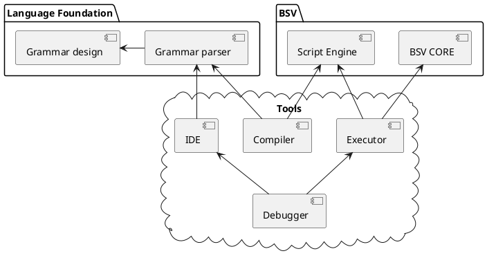

## High Level Language investigation

There are existing implementation in the crypto currencies spaces. Some of them are new projects, some has reached a certain maturity. Below are a few examples listed on the most important chains

|Language   | inspired  |   editor     | compiler |  debug  | chain |    app     | doc  |
|-----------|-----------|--------------|----------|---------|-------|------------|------|
|Tokenized  | protobuf  |      NA      |   NA     |   NA    |  BSV  | ownership  | 4/5  |
|  sCrypt   | solidity  |  web/VS code |   yes    |   yes   |  BSV  | generic    | 3/5  |
|CashScript | solidity  |      NA      |  cashc   |   NA    |  BCH  | generic    | 3/5  |
|Simplicity | solidity  |      NA      |   Nix    |   NA    |  BTC  | generic    | 4/5  |
|Solidity   | c++/py/js |  web/VS code |  remix   | VS code |  ETH  | generic    | 5/5  |

The time allocated for the investigation was short and aim to a large horizon, hence feedback are based on the documentation of each projects, some blogs and conference video. It is to be considered as an overview rather than an deep technical detail feedback. Even considering as overview, it might be baised as it is based on the project's documentation. Some projects might have good documentation but poor quality and vice versa.

The highlighted impression is that Ethereum has the best quality in all measures : documentation, tools, language design foundation. The reason is obviously because this is their central feature. Other BTC-liked chains has all already some high level language project, but they all characterizes differently. Some are good at documentations, other is good at language design foundation, other good at tools implementation as IDE, compiler, debugger.

---

#### Bitcoin SV

[Tokenized](https://tokenized.com/) first release in May 2019. It focus on the detail technical design of the protocol on BSV chain rather than language design. Tokenized store binary data sheltered behind `OP_RETURN`. The binary data is a structured message serialized through protobuf utility. Users are free to define the message struture to apply to their business domain. Tokenized has some sub projects implmenting different abilities (smart contract, wallet etc) : [project list](https://github.com/tokenized)

[sCrypt](https://github.com/scrypt-sv) is a true high level language design project in the sense it define the language, provide the full tools set as IDE, compiler, debugger. All the tools can be live demoed [on web](https://scrypt.studio/) or integrated as VS code extension. Its language design is inspired by Solidity from ETH, but the technical detail fits for BSV chain. The ultimate target is to allow BSV to have smart contract ability. Documentation can be found at [scryptdoc](https://scryptdoc.readthedocs.io/en/latest/intro.html)

#### Bitcoin Cash

[CashScript](https://cashscript.org/) is the project started in May 2019 aiming to enable smart contract on BCH. It has relatively good language definition inpiring from Solidity syntax and provide tools set implemented by javascript (cashc CLI and cashscript SDK). Having [activated some additional op code](https://kalis.me/smart-contracts-eth-btc-bch/) to make cashscript's smart contract more useful, cashscript is stil bounded by the size limite due to the limited block size.

#### Elements
[Simplicity](https://github.com/ElementsProject/simplicity) developed by blockstream, still a young project, but started with a high quality of language design foundation. The project has started in mid 2017 and still active as from now in mid 2020. Though it haven't gained its popularity on a prevalent chain, it can be a very good reference to start designing a language. The tools provided are implemented in haskell.

#### Ethereum
[Solidity](https://solidity.readthedocs.io) is an OOP language designed specifically for writting smart contracts. Its development has been started in late 2014 until now. Solidity can work on various blockchain, but most popular on ETH. The language style has inspired by javascript/C++/python, is defind as a strong typed language. Though specifically designed for smart contract, it is actually the most prevalent high level language for blockchain. It reached the highest maturity comparing to all other high level languages. It has provided the full tools set to programmers, very well documented and have large community.

---

Working on high level language consiste of designing the language and provide all the necessary tools for programming in this language. Basical steps/components to do are

- Language design foundation : It is the most important step. It requires rigorous grammar definition in the mathematical fashion.
- Language Grammar definition
- Compiler : Can take time to implement, but will be easy if the 2 first step are well done
- IDE : Can be easy if the parser has been implemented.
- Debugger : Not as easy as other tools.
- Executor : Already exist in bitcoin code (EvalScript).

